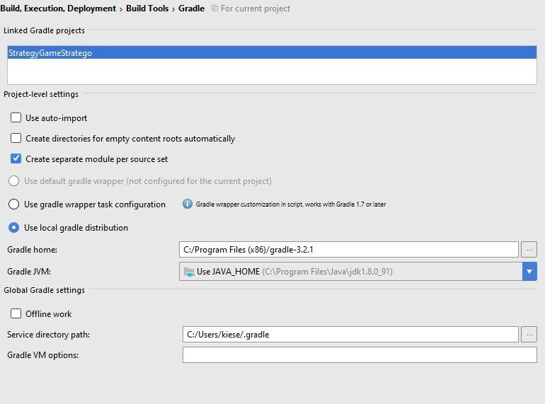
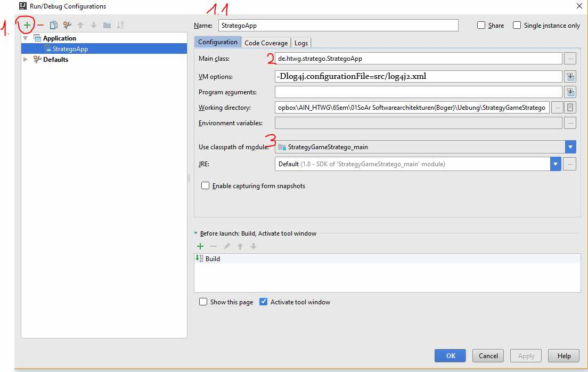

# Strategy Game Stratego

by jualtmey and redcarwolf

## used technologies
|picture|name|used|
|---|---|---|
||[google guice](https://github.com/google/guice)|makes it modular using **dependency injection**|
||gradle|buildtool|
TODO: to be completet

## installation with Intelij

1. get data with 
    ```
    git clone 
    ```
2. open Intelij
    * open File/New/Project from existing Sources
    * select Folder of cloned repo
    * use gradle as build tool
    * 
    * ignore maven popups


3. after gradle build everything
    * open Run/Edit_Configurations
        * add a new Application with the green plus
        *  

4. click Run/Run'StrategoApp'